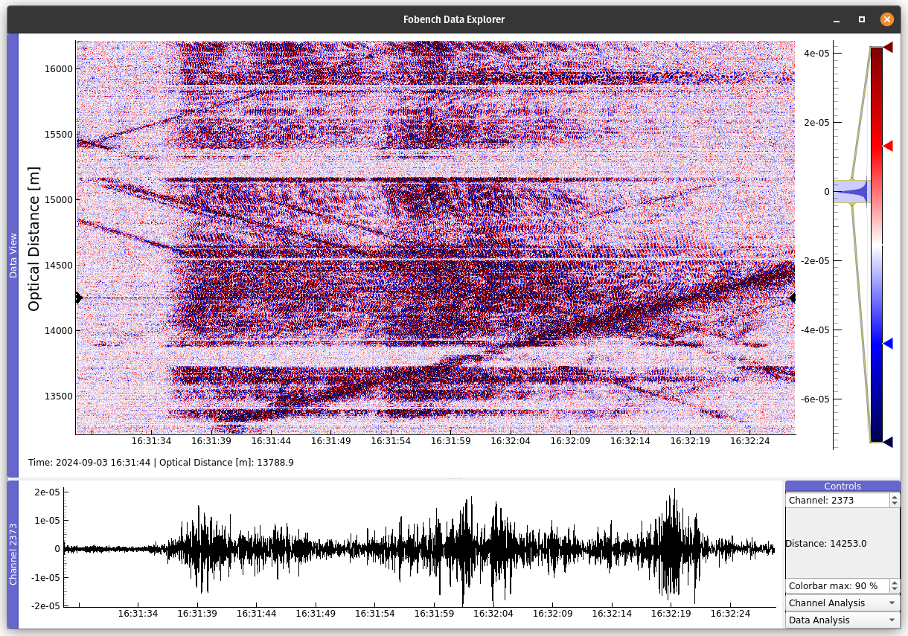

The Fobench Data Explorer
=========================
Start the data explorer for every instance of the Fiber class by calling ``Fiber.view()``

   The Data Viewer Window

Methods
---------------------

