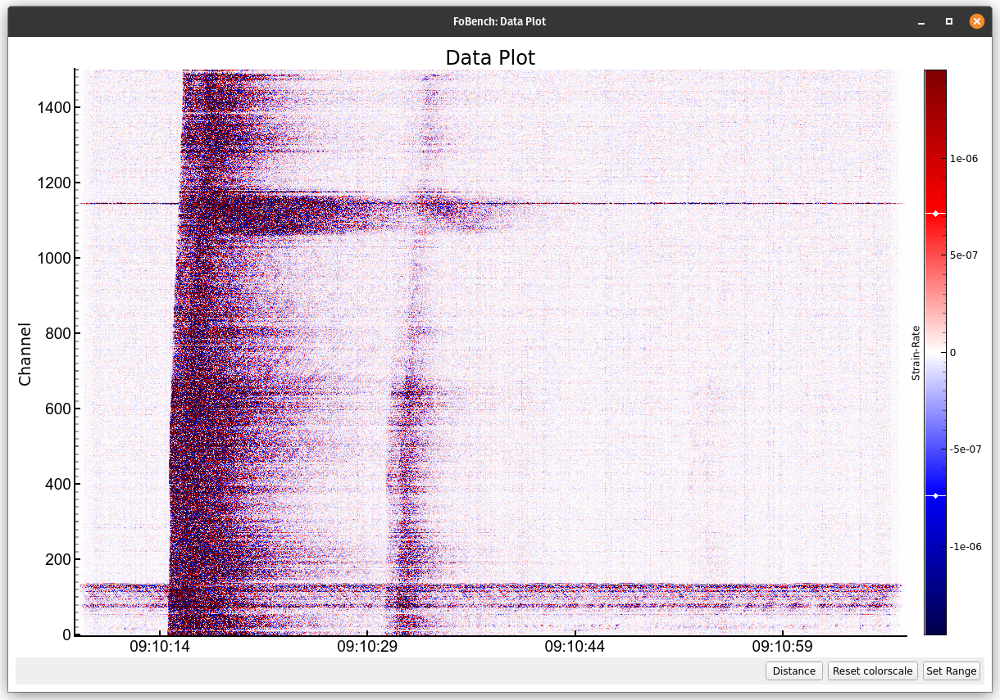
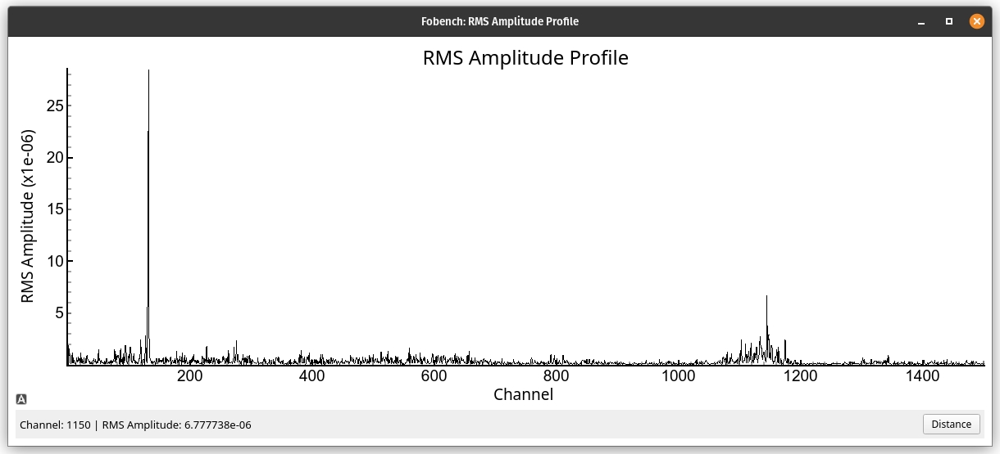
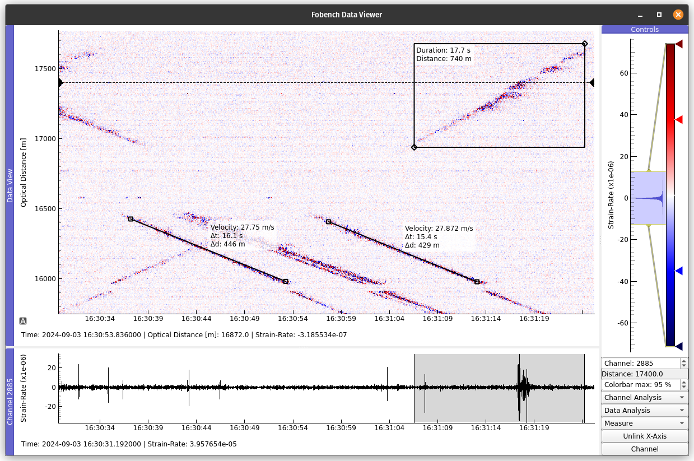

Visualizations
==============
FoBench focuses on high-speed visualizations and interactivity to make data exploration more efficient. Therefore, instead of relying on *matplotlib*, FoBench leverages *PyQtGraph* for generating plots. While not offering the same polished look, the difference in speed is significant, especially for larger data matrices. 

Whenever a function or method can generate a plot, the ``plot_mode`` parameter can be set. It defaults to ``"pyqt"`` and *matplotlib* plotting is chosen by setting ``plot_mode = "mpl"``. Not all functions and methods offer a *matplotlib* plot output however, in these cases FoBench falls back to ``"pyqt"``. If ``plot_mode`` is set to anything else than these two keywords, e.g. ``plot_mode = None``, no plot is generated.

All functions are able to return the processing results so that you can design your own plots around them for publications etc.

   The Data Plot Window

**Navigating** through the plots is done using the mouse buttons and the scrolling wheel. 
*PyQtGraph* has two modes available to interact with plots:

- **1 button**: Zoom into the plot by scrolling or by drawing a rectangle around the area of interest using the left mouse button. By holding the right mouse button and moving the mouse up-down and left-right you are able to stretch and compress each dimension. 

- **3 button**: Instead of drawing an area of interest with the left mouse button you now pan though the plot when zoomed in.

Switch between both modes by right clicking on the main panel to open the context menu, go to :guilabel:`Mouse Mode` and click :guilabel:`3 button` or :guilabel:`1 button`

Click the :guilabel:`A` in the bottom left or righ-click and choose :guilabeL:`View All` to **reset the plot**

Visuals that contain a matrix plot will have a **colorbar** on the right side. A right click on it lets you choose the colormap. You can edit the limits of the colormap interactively by adjusting the handles of the colorbar, by manually setting a range through the :guilabel:`Set Range`-dialog or by calling the plots with the ``vmin`` and/or ``vmax`` parameters. The colorscale can always be reset to the values it had when the plot was generated using the :guilabel:`Reset colorscale`-button.

At the bottom left of the window you will find the current **position of your cursor in data units**. On the bottom right, the :guilabel:`Channel`/:guilabel:`Distance`-button lets you switch the axis labels between channel numbers and optical distance if the plot has a space dimension. 

   Plot of the RMS Amplitude Profile

Exporting Plots
---------------
There are two options to save a PyQtGraph figure to your computer, from the GUI or through the API.

Exporting from the GUI
^^^^^^^^^^^^^^^^^^^^^^
To **save a plot as a file to your computer**, right click anywhere in the open window, and choose :guilabel:`Export`. In the dialog that opens choose what part of the plot you would like to export and the file format (most likely ``Image File``), adjust the other parameters if necessary and finally click :guilabel:`Export`. Plots from the Data Viewer can only be exported through the GUI. 

Exporting through the API
^^^^^^^^^^^^^^^^^^^^^^^^^
Every function or method that generates a PyQtGraph figure can be called with the ``export`` parameter. If you pass a filepath string, the figure will be saved in that location, e.g. ``export="/home/user/Desktop/earthquake.png"``. Additionally you can disable displaying the plot by setting ``show=False``, this is especially useful when batch processing.

Data Viewer
-----------
The data viewer allows to explore data with some added interactivity. Start the data viewer for every instance of the Fiber class by calling ``Fiber.view()``. Upon openening the window is composed of the main panel holding a time-distance plot, the bottom panel with a channel plot and a control panel on the right side.

.. figure:: _static/explorer_screenshot.png
   :width: 100%
   :alt: Viewer
   :align: center

   The Data Viewer Window

The panels can be **changed in their relative size and can be rearranged** by dragging the blue top bars to the desired location. A double click on the top bar pops the panel out into a seperate window.

The channel plot is controlled by **editing the desired channel number** in the control panel or by **moving the black handle** in the main panel to the channel of interest. The corresponding optical distance is indicated below the channel selector in the control section. The channel and the time-distance plot are linked, i.e. zooming into one also zooms into the other such that the time axis is always aligned. This behaviour can be switched off using the :guilabel:`Unlink X-Axis` button.

In the data viewer the colorbar can additionally be controlled through the :guilabel:`Colorbar max` spinbox. It determines the **maximum percentile** that the colorbar is scaled to.
From the dropdown menus :guilabel:`Channel Analysis` and :guilabel:`Data Analysis` some methods of the ``Fiber`` class can be called directly and their results will be displayed in new tabs. Methods from :guilabel:`Channel Analysis` are always performed on the currently selected channel.

Measuring Tools
^^^^^^^^^^^^^^^
From the :guilabel:`Measure` dropdown menu, two measurement tools can be chosen: 

- :guilabel:`Time-Space` will generate a rectangular Region of Interest (ROI) in the main panel. It displays its extents in data units and can be used to measure features in time and space. The ROIs extent in time is also indicated in the bottom channel plot panel. Change the size of the ROI by dragging one of the two handles or hold :guilabel:`Ctrl` and drag the mouse to scale it. 

- :guilabel:`Velocity` will generate a linear ROI in the main panel. It displays its slope i.e. the velocity of a feature. Drag the line to adjust position and use the two handles to adjust the slope.

Multiple ROIs can be added to the plot at the same time. To remove a ROI, right click inside or on it and choose :guilabel:`Remove ROI` from the context menu.

   The Time-Space and Velocity tools
